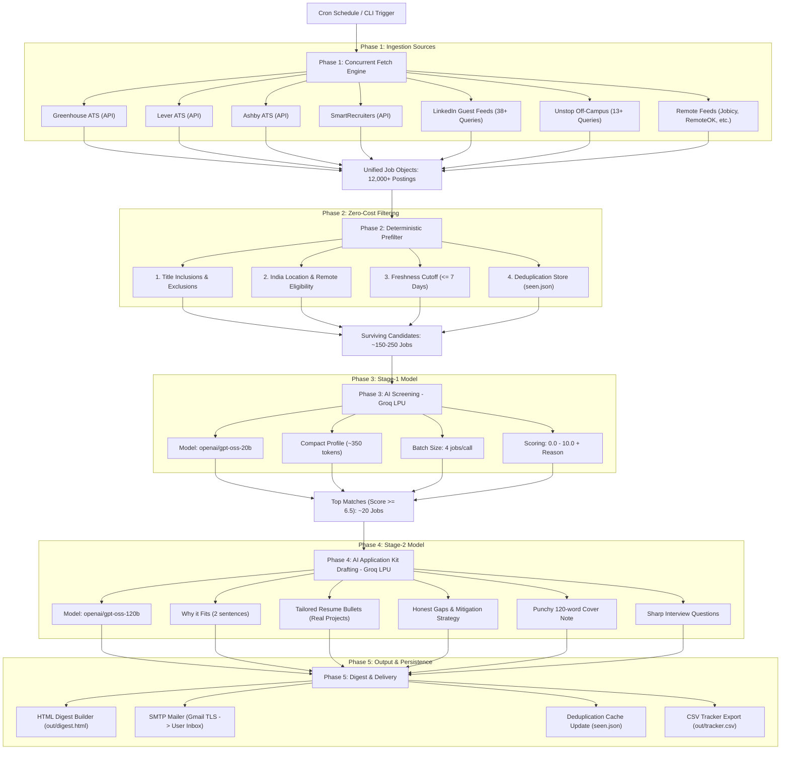

# 🚀 EverydayJobs: Autonomous AI-Powered Job Hunting & Application Prep Pipeline
### *Comprehensive Architecture, Technical Design & Engineering Guide*

---

## 📌 1. Executive Summary & Problem Statement

Searching for jobs as an engineer is notoriously tedious:
1. **Scattered Portals**: Jobs are fragmented across hundreds of company career pages (Greenhouse, Lever, Ashby, SmartRecruiters), job boards (LinkedIn), and hackathon/off-campus platforms (Unstop).
2. **Noise & Irrelevance**: 95%+ of postings are either outdated (>7 days old), restricted to US/EU work authorizations, senior/staff levels, or irrelevant tech stacks.
3. **Application Fatigue**: Tailoring resumes, writing personalized cover letters, and preparing interview questions for dozens of positions takes hours every day.

**EverydayJobs** is an end-to-end autonomous, zero-cost pipeline that:
- Ingests **12,000+ live jobs** concurrently every day from 100+ direct company ATS portals, LinkedIn India, and Unstop.
- Deterministically eliminates noise using zero-cost regex and date algorithms.
- Screens candidates using high-speed **Groq LPU AI inference** against the candidate's exact project portfolio.
- Drafts tailored resume bullet points, honest gap assessments, customized cover notes, and interview prep questions for top-scoring jobs ($\ge 6.5/10$).
- Dispatches a dark-mode, mobile-optimized HTML digest to your inbox at **6:00 AM & 6:00 PM IST** daily via **GitHub Actions**.

---

## 🏗️ 2. High-Level Architecture & Data Flow



---

## 💻 3. Technology Stack & Design Decisions

| Component | Technology / Library | Why It Was Chosen |
|---|---|---|
| **Language** | Python 3.11+ / 3.12 | Native async/concurrency, rich standard library, cross-platform compatibility. |
| **LLM Provider** | **Groq LPU Inference Engine** | ~10x faster inference than traditional GPUs; generous free-tier limits. |
| **Screening Model** | `openai/gpt-oss-20b` | Lightweight, fast batch screening (1,000 RPM capacity). |
| **Drafting Model** | `openai/gpt-oss-120b` | High-intelligence reasoning for resume tailoring and cover letter generation. |
| **Fallback LLMs** | Google Gemini (`gemini-2.5-flash`), Anthropic (`claude-3-5-haiku`), Ollama | Full provider-agnostic interface (`Provider` base class). |
| **HTTP & Networking** | `requests`, `urllib3`, connection pooling | Robust retry backoff, custom User-Agents, TLS session reuse. |
| **Email Protocol** | Python `smtplib` + `email.mime` | Zero-dependency, reliable TLS dispatch via Gmail SMTP (port 587). |
| **CI/CD & Cron** | **GitHub Actions** | Free scheduled runs at 6:00 AM & 6:00 PM IST; `actions/cache` preserves dedupe state. |
| **Template Engine** | Pure Python HTML Builder | Zero external template dependencies; produces dark-mode, mobile-responsive HTML. |
| **Persistence** | JSON (`seen.json`) & CSV (`tracker.csv`) | Human-readable, gitignorable, zero database setup needed. |

---

## 📂 4. Repository Structure & Module Breakdown

```
Everydayjobs/
├── .github/
│   └── workflows/
│       └── daily.yml          # GitHub Actions scheduled cron workflow (6 AM & 6 PM IST)
├── jobhunt/
│   ├── __init__.py            # Package root & semantic version
│   ├── cli.py                 # Command-line interface & main orchestrator
│   ├── fetch.py               # Concurrent multi-platform ingestion engine
│   ├── prefilter.py           # Zero-cost regex and date prefiltering
│   ├── providers.py           # Provider-agnostic LLM client (Groq, Gemini, Claude, Ollama)
│   ├── llm.py                 # Two-stage prompt engineering (Screening & Drafting)
│   ├── digest.py              # Dark-mode HTML email template renderer
│   ├── mailer.py              # SMTP TLS email dispatch
│   └── store.py               # Deduplication store & CSV tracker manager
├── companies.yaml             # 100+ verified direct company ATS slugs (Greenhouse, Lever, Ashby, etc.)
├── config.yaml                # Global rules, search titles, location constraints, score thresholds
├── profile.json               # Candidate portfolio (gitignored for privacy)
├── profile.example.json       # Candidate profile template (used by GitHub Actions CI)
├── requirements.txt           # Minimal pip dependencies (requests, pyyaml)
└── README.md                  # Quickstart documentation
```

---

## ⚙️ 5. Deep Dive: Pipeline Execution Phases

### Phase 1: Ingestion & Parsing Engine (`jobhunt/fetch.py`)
- **Concurrency**: Uses `concurrent.futures.ThreadPoolExecutor(max_workers=16)` to query 100+ endpoints in parallel within ~15 seconds.
- **Direct ATS Ingestion**:
  - **Greenhouse**: `https://boards-api.greenhouse.io/v1/boards/{slug}/jobs?content=true`
  - **Lever**: `https://api.lever.co/v0/postings/{slug}?mode=json`
  - **Ashby**: `https://api.ashbyhq.com/posting-api/job-board/{slug}`
  - **SmartRecruiters**: `https://api.smartrecruiters.com/v1/companies/{slug}/postings`
- **Job Aggregators & Boards**:
  - **LinkedIn Guest Search**: 38+ Pan-India job queries targeting entry-level, junior, AI, Python, backend, and fresher keywords with freshness filter `f_TPR=r604800` (posted within 7 days).
  - **Unstop Off-Campus**: 13+ specialized queries fetching national hiring challenges and off-campus drives.
  - **Remote Feeds**: Jobicy, RemoteOK, Remotive, and Arbeitnow RSS/JSON APIs.
- **Normalization**: Every source is converted into a standard dataclass:
  ```python
  @dataclass
  class Job:
      job_id: str          # e.g., "greenhouse:databricks:12345"
      company: str         # "Databricks"
      title: str           # "Software Engineer - AI"
      location: str        # "Bengaluru, Karnataka, India"
      url: str             # Application URL
      description: str     # Full plain-text job description
      posted_at: str       # ISO-8601 timestamp
      source: str          # "greenhouse" | "linkedin" | "unstop"
  ```

---

### Phase 2: Deterministic Prefilter (`jobhunt/prefilter.py`)
**Why this matters**: LLM tokens cost time and money. The prefilter reduces **12,000+ raw postings down to ~200 high-potential candidates for $0.00 cost** in 50 milliseconds:
1. **Title Filter**: Requires inclusion matches (`Software Engineer`, `AI Engineer`, `Python Developer`, `Backend`, `Machine Learning`) and discards exclusions (`Senior`, `Lead`, `Manager`, `Director`, `Staff`, `Principal`, `VP`, `Architect`, `C++ Driver`, `DevOps Lead`).
2. **Location & Geo-Restriction Gate**:
   - Matches Indian cities: `Bengaluru`, `Hyderabad`, `Pune`, `Gurgaon`, `Noida`, `Chennai`, `Mumbai`, `India`.
   - Allows worldwide remote jobs while actively discarding geo-restricted remote roles matching `RESTRICTED_NON_INDIA_PATTERNS` (e.g., `US only`, `North America only`, `UK only`, `EMEA only`, `Remote (US)`).
3. **Freshness Filter**: Discards any posting older than `max_age_days: 7`.
4. **Deduplication Gate**: Cross-checks against `seen.json`. If a posting was already emailed in a previous run, it is silently skipped.

---

### Phase 3: AI Screening Pass (`jobhunt/llm.py` & `jobhunt/providers.py`)
- **Model**: `openai/gpt-oss-20b` via Groq LPU.
- **Input Optimization**:
  - Instead of sending the full 5-page resume, a compact candidate summary (~350 tokens) containing core skills, project highlights, target titles, and seniority is used.
  - Jobs are batched in groups of 4 (`screen_batch_size: 4`), with descriptions truncated to 800 characters.
- **Output**: Returns a strict JSON list of scores and 1-sentence rationales:
  ```json
  [
    {
      "job_id": "linkedin:infosys:4436806212",
      "score": 9.0,
      "reason": "Strong match with candidate's Python, FastAPI, and GenAI project portfolio."
    }
  ]
  ```
- **Threshold**: Only jobs with `score >= 6.5` advance to the drafting stage (capped at top 20).

---

### Phase 4: AI Application Kit Drafting (`jobhunt/llm.py`)
- **Model**: `openai/gpt-oss-120b` (High-reasoning 120-Billion parameter model on Groq).
- **Drafting Prompt**: One individualized call per top-ranking job with up to 2,200 characters of the full Job Description and the candidate's complete portfolio.
- **Generated Kit**:
  1. **`fit_summary`**: 2 concise sentences explaining why the candidate is a strong match.
  2. **`tailored_bullets`**: 3–4 customized resume bullet points directly mapping the candidate's actual projects (*AI Crop Doctor, ThumbAI, QRAVE, Viswam.AI*) to the company's requirements.
  3. **`gaps`**: 1–3 honest skill gaps and how the candidate can address them.
  4. **`cover_note`**: A 120-word punchy, professional cover note ready to paste into application boxes.
  5. **`questions_to_ask`**: 2 insightful interview questions proving the candidate thoroughly understood the JD.

---

### Phase 5: Digest Generation, SMTP Delivery & Tracking (`jobhunt/digest.py`, `jobhunt/mailer.py`, `jobhunt/store.py`)
1. **HTML Builder**:
   - Generates a responsive, dark-mode email styled with clean CSS cards (`#0f1115` background, `#171a21` cards, neon green match badges `#3fb950`).
   - Includes direct clickable **"Open & Apply →"** links for every position.
2. **SMTP Dispatch**:
   - Connects to `smtp.gmail.com:587` over TLS.
   - Dispatches a multipart email (`text/plain` fallback + `text/html`) to `snehithetsy@gmail.com`.
3. **Tracking & State Storage**:
   - Records all screened and emailed jobs into `seen.json` (UTF-8 encoded) to prevent duplicates forever.
   - Exports `out/tracker.csv` with status columns (`first_seen`, `score`, `applied`, `applied_on`, `url`).

---

## ⏰ 6. Cloud Automation Architecture (GitHub Actions)

The repository runs autonomously in the cloud without requiring your computer to be turned on.

### Workflow Configuration (`.github/workflows/daily.yml`):
- **Schedule**:
  ```yaml
  on:
    schedule:
      - cron: "30 0,12 * * *" # 00:30 UTC (06:00 AM IST) & 12:30 UTC (06:00 PM IST)
    workflow_dispatch:        # Allows manual 1-click trigger from GitHub UI
  ```
- **State Persistence via `actions/cache`**:
  - GitHub Actions runners are ephemeral (they delete their disks after every run).
  - To prevent `seen.json` from disappearing, `actions/cache@v4` saves `seen.json` at the end of each run and restores it at the beginning of the next run.
- **Security & Secrets**:
  - All credentials (`GROQ_API_KEY`, `SMTP_PASS`, `GEMINI_API_KEY`) are encrypted using GitHub Secrets and injected into environment variables at runtime.

---

## 🛠️ 7. Methods, Classes & Function Reference

### `jobhunt.fetch`
- `fetch_all(cfg: dict) -> list[Job]`: Orchestrates concurrent thread pools across all sources.
- `fetch_board(board_type: str, slug: str) -> list[Job]`: Dispatches requests to Greenhouse/Lever/Ashby/SmartRecruiters.
- `fetch_linkedin_feed(query: str, location: str) -> list[Job]`: Scrapes LinkedIn guest search feeds.
- `fetch_unstop_feed(query: str) -> list[Job]`: Queries Unstop public competition and job API.

### `jobhunt.prefilter`
- `prefilter(jobs: list[Job], cfg: dict) -> list[Job]`: Deterministic filtering pipeline.
- `_any_match(patterns: list[str], text: str) -> bool`: Case-insensitive regex evaluation.
- `_parse_date(value: str) -> datetime`: Multi-format ISO-8601 parser.

### `jobhunt.providers`
- `Provider.complete(model, system, user, max_tokens, json_mode) -> str`: Base abstract interface.
- `GroqProvider.complete(...)`: Groq API client with HTTP 429 rate limit backoff and network retry logic.
- `GeminiProvider._post(...)`: Google AI Studio REST client with SSL connection resilience.
- `resolve(stage: str) -> tuple[Provider, str]`: Dynamically resolves provider and model based on environment variables.

### `jobhunt.llm`
- `screen(jobs, profile, jd_chars, batch_size) -> list[Job]`: Stage-1 batch job evaluation.
- `draft(jobs, profile, jd_chars) -> list[Job]`: Stage-2 detailed application kit generator.
- `parse_json(raw: str) -> Any`: Resilient JSON parser stripping Markdown fences and conversational artifacts.

### `jobhunt.mailer`
- `send(subject, html_body, to_addr, cfg) -> None`: Authenticated SMTP TLS mail sender.

### `jobhunt.store`
- `Store.record(jobs, emailed: bool)`: Updates deduplication index and persists to disk.
- `Store.export_csv(path)`: Exports application tracker spreadsheet.

---

## 🎯 8. Summary of Candidate Profile Integration

The pipeline is tuned specifically for **Snehith** (B.E. Computer Science, Junior / 0 YOE):
- **Core Stacks Highlighted**: Python, FastAPI, PyTorch, Generative AI, LLMs, Computer Vision, OpenCV, PostgreSQL, Redis, Docker.
- **Projects Mapped**:
  1. **AI Crop Doctor**: YOLOv8, MobileNetV2, OpenCV plant disease segmentation.
  2. **ThumbAI**: Multi-model multimodal generation (SAM, InsightFace, GFPGAN, EasyOCR, Gemini API).
  3. **QRAVE**: Full-stack backend (FastAPI, Node.js, PostgreSQL, Redis, BullMQ).
  4. **Viswam.AI Internship**: RAG pipelines, LangChain, prompt engineering.

This ensures every cover letter, bullet rewrite, and interview question generated by the AI reads like an authentic, qualified engineer rather than generic boilerplate.
